# 仿12306JAVAEE-JSP项目

#### 项目简介
 12306互联网购票是基于中国铁路客票系统构建的，历时两年研发成功，是目前世界上规模最大的实时交易系统之一。正是基于此本人将其临摹部分功能以达到技术提升为目的，未作任何商业用途。此项目是一款JAVAEE 
B2C项目。

#### 项目需求

1. 用户注册
2. 用户登录
3. 查看个人信息
4. 修改个人信息
5. 普通用户密码修改

#### 数据库
ORACLE

#### 后端语言
JAVA

#### 前端
JS JSP 

#### 配置环境

Jdk 1.8 

Tomcat 8.0.47 

Oracle 11.2.0.1.0

#### 开发工具

Eclipse 4.11.0

PL/SQL 11.2.0.1.0 

Vscode 1.34.0

#### 项目需求
##### 一般性需求
+ 集中数据管理、分布式应用，实现信息的全面共享，为决策者提供最新的数据。

+ 完全基于浏览器的操作模式，安装简单、操作方便，具有良好的系统扩充能力。

+ 灵活的模块需求设计，可根据实训项目周期灵活裁剪。

+ 严格的安全管理机制。利用SSL技术维护网络传输安全，利用安全规则和特权保证基本信息的安全管理，提供日常操作的审计功能，并对重要的安全事件提供报警，对重要数据进行加密。
##### 功能性需求
###### 角色说明

整个业务流程会涉及到如下角色：用户、基础数据管理员、计划管理员、调度管理员、客服人员、财务管理员。

各角色在本系统中的工作流程所起的作用如下：

+ 用户：首先注册或登录，然后进行余票查询，完成订单，最终完成取票。他在本系统中即是服务的起点，也是服务的终点。
+ 基础数据管理员：负责对线路、站名、里程等路网信息进行维护；负责对票价信息进行维护；负责对列车编组、车次、时刻表等运行图信息进行维护。
+ 计划管理员：负责对车站计划管理功能模块的维护，主要包括车站票额分配计划的编制、查询、删除、检测和席位的发布。
+ 调度管理员：负责完成车站客运统计，席位发布以后票额用途的实时调整、查询和剩余票额的实时查询。
+ 客服人员：负责用户管理，订单的维护，车票的维护。
+ 财务管理员：车站依据存根进行订票、发售、退票的结账和财务统计，依据席位进行客运量统计。
##### 功能列表
| 功能名称	| 备注	| 裁剪说明 |
| -------  | ----- | ------- |
|基础数据维护|	线路、站名、里程等路网信息；票价信息；列车编组、车次、时刻表等运行图信息。|	不可裁剪 |
|计划管理|	车站计划管理功能模块主要完成车站票额分配计划的编制、查询、删除、检测和席位的发布。|	不可裁剪|
|调度管理|	车站客运统计，席位发布以后票额用途的实时调整、查询和剩余票额的实时查询。|	可完全裁剪|
|订单管理	|余票查询，下单，取消订单，修改订单，订单查询，支付等。|	不可裁剪|
|票务管理	|取票，退票，改票，转签，车票查询等。|	不可裁剪|
|财务统计	|根据销售方式、车次进行统计；对退票进行统计	|可完全裁剪|
|用户管理|	用户的注册、登陆、个人信息维护等。|	不可裁剪|

其中，基础数据维护、计划管理、调度管理、票务管理、财务统计属于后台管理部分，由铁路相关人员维护；订单管理、用户管理属于用户订票部分，由用户参与维护。

##### 基础数据维护
数据维护模块中所操作的数据是整个客票系统能够正常运转的基础，主要包括基础数据
和运行数据两部分。基础数据是指铁路局、线路、区段、站名等相对稳定的路网数据；运行数据是指列车停靠站、浮动票价等需要根据运营要求不断变化的数据，一般来说是与列车相关的一系列数据。
###### 车站管理
该部分主要用来维护车站相关信息。
**需求描述**
功 能 需 求
| 功能名称 | 	车站管理|
| ---------- | -------|
|优先级	|高|
|参与者|	基础数据管理员|
|业务背景|	该功能主要用来维护车站相关的信息。|
|基本需求	| 1、增加新车站 2、删除车站 3、修改车站信息  4、查询车站|
|可选需求 |
|约束条件	|系统要求车站的编号唯一。如果要删除的车站已经存在线路，不能删除。|
|相关查询	|查询车站信息：可以按照站名，拼音码，所属铁路局进行查询。|
|其他需求	|无|
|裁剪说明	|不可裁剪|

###### 数据描述

车站基本信息

|名称	|描述|	是否必添|
|----|----|-----|
|车站代码	|用来唯一区别一个车站的	|是|
|车站名	|如北京西|	是|
|拼音码	|如BJX|	是|
|所属铁路局	|	|否|
|车站等级	|车站按业务量，地理条件分为特，一，二，三，四，五等站。|	否|
|所属行政区域	|	|是|
|联系地址	|	|否|

###### 列车管理

该部分主要用来维护列车相关信息。

**需求描述**
功能需求：
|功能名称	|列车管理|
| ------ | ------- |
|优先级|	高 |
|参与者 |	基础数据管理员 |
|业务背景 |	该功能主要用来维护列车相关的信息。|
|基本需求	|1、增加新列车2、删除列车3、修改列车4、查询列车|
|可选需求 |
|约束条件	|系统要求车次编号唯一。如果要删除的列车已经增加编组、线路信息，不能删除。|
|相关查询	|查询列车信息：可以按车次查询。|
|其他需求	|无|
|裁剪说明	|不可裁剪|

**数据描述**
列车信息：
|名称|描述|	是否必添|
| ---- | ---- | ---- |
|车次代码|	用来唯一区别一个编组	|是|
|始发站 |		|是|
|终到站|		|是|
|始发时间|		|是|
|终到时间|		|是|
|历时|		|是|
|里程|		|是|
|无座票数量|		|是|
|车辆车体分类	|如新空调等|	是|
|列车类型	|如直达特快、特快、普快、普客等|	是|

###### 线路管理
该部分主要用来维护火车线路相关信息。
**需求描述**
功能需求：

|功能名称	|线路管理|
|------|--------|
|优先级	|高|
|参与者	|基础数据管理员|
|业务背景	|该功能主要用来维护火车线路相关的信息。|
|基本需求	|1、增加新线路2、删除线路3、修改火车线路4、查询线路|
|约束条件	|系统要求车次编号唯一。如果要删除的车站已经售票，不能删除。|
|可选需求 |
|相关查询	|查询线路信息：可以按照站名，车次查询。|
|其他需求	|无|
|裁剪说明	|不可裁剪|

**数据描述**
线路基本信息:
|名称	|描述	|是否必添|
| ----- | ------ | -----|
|线路编号	|用来唯一区别一个线路，可以自动生成	|是|
|车次代码|		|是|
|车站名|		|是|
|发车时间|		|是|
|到站时间|		|否|
|里程|		|否|
|停留时间|		|是|
|历时|		|是|
|车站序号|		|是|
###### 列车编组管理
该部分主要用来维护列车编组相关信息。
**需求描述**
功 能 需 求:
|功能名称	|列车编组管理|
|--------|-----------|
|优先级	|高|
|参与者	|基础数据管理员|
|业务背景	|该功能主要用来维护列车编组相关的信息。|
|基本需求	|1、增加新编组2、删除编组3、修改编组4、查询编组|
|可选需求|	
|约束条件	|系统要求车次编号唯一。如果要删除的车站已经售票，不能删除。|
|相关查询|	查询编组信息：可以按车次查询。|
|其他需求|	无|
|裁剪说明|	不可裁剪|

**数据描述**
列车编组信息：
|名称	|描述	|是否必添|
|列车编组编号	|用来唯一区别一个编组，可以自动生成	|是|
|车次代码|		|是|
|车厢号|		|是|
|车厢座席类型|	硬座、软座、硬卧上、硬卧中、硬卧下等	|否|
|车厢座席数量|		|否|
|车厢类型|	有硬座车、软座车、硬卧车、软卧车、餐车等	|否|
###### 票价率管理
	该部分主要用来维护票价率相关信息，请参考相关文档。
**需求管理**
功能需求：
|功能名称	|票价率管理|
|------|---------|
|优先级	|高|
|参与者|	基础数据管理员|
|业务背景|	该功能主要用来维护票价率相关的信息。|
|基本需求	|1、修改票价率2、查询票价率|
|可选需求|	
|约束条件|	系统要求票价率编号唯一。|
|相关查询	|查询票价率信息|
|其他需求|	无|
|裁剪说明	|不可裁剪|
**数据描述**
列车编组信息：
|名称	|描述	|是否必添|
|-----|-----|---|
|票价率编号|	用来唯一区别一个编组，可以自动生成|	是|
|票种|		|是|
|票价率|		|是|
|比例|	|	否|
###### 票价旅程区段管理
该部分主要用来维护旅程区段相关信息，请参考相关文档。

**需求描述**功 能 需 求：
|功能名称|	旅程区段管理|
|--------|-----|
|优先级|	高|
|参与者	|基础数据管理员|
|业务背景|	该功能主要用来维护旅程区段相关的信息。|
|基本需求	|1、修改旅程区段2、查询旅程区段|
|可选需求|	
|约束条件|	系统要求区段编号唯一。|
|相关查询	|查询旅程区段信息|
|其他需求|	无|
|裁剪说明|	不可裁剪|
**数据描述**
旅程区段信息：
|名称	|描述|	是否必添|
|-----| ----|-----|
|旅程区段编号	|用来唯一区别一个区段，可以自动生成|	是|
|里程区段From|		|是|
|里程区段To|		|是|
|每区段里程|		|是|
|区段数|		|是|
###### 递远递减率管理
该部分主要用来维护递远递减率相关信息，请参考相关文档。
**需求描述**功 能 需 求：
|功能名称	|递远递减率管理|
| ------ | -------|
|优先级|	高|
|参与者	|基础数据管理员|
|业务背景	|该功能主要用来维护递远递减率相关的信息。|
|基本需求	|1、修改递远递减率2、查询递远递减率|
|可选需求	|
|约束条件	|系统要求编号唯一。|
|相关查询	|查询递远递减率信息|
|其他需求	|无|
|裁剪说明	|不可裁剪|
**数据描述**
递远递减率信息：
|名称	|描述	|是否必添|
| -----| ------| ----- |
|递远递减率编号|	用来唯一区别一个递远递减率，可以自动生成	|是|
|里程区段From|		|是|
|里程区段To|		|是|
|递减率|		|是|
|票价率|	|是|
|各区段全程票价|		|否|
|区段累计票价|		|否|

##### 计划管理
车站计划管理功能模块主要以车厢为单位完成车站票额分配计划的编制、查询、删除、检测和席位的发布。

该部分主要用来维护车站票额分配计划相关信息。

**需求描述**功 能 需 求：
|功能名称|	计划管理|
|------| -------|
|优先级|	高|
|参与者	|计划管理员|
|业务背景	|该功能主要用来维护计划相关的信息，票额分配计划以车次为单位（不包含日期）进行制定，当首次制定计划后，后续都可重用此计划，或在此计划的基础上调整。如果某次车的车厢数临时发生调整，则原计划必须进行修改后才能进行席位发布。|
|基本需求	|1、选择需要编制计划的车次，增加新计划2、选择需要编制计划的车次，删除计划3、选择需要编制计划的车次，修改计划4、选择需要编制计划的车次，查询计划5、执行计划，完成席位的发布。|
|可选需求|	
|约束条件|	系统要求计划编号唯一。|
|相关查询	|查询计划信息：可以按照车次进行查询。|
|其他需求|	无|
|裁剪说明	|不可裁剪|

###### 数据描述
计划信息:
|名称	|描述	|是否必添|
|-----|----|-----|
|计划代码	|用来唯一区别一个计划，可以自动生成|	是|
|车次代码|		|是|
|车厢号|		|是|
|比较|	如=，>=，<=|	是|
|车站|	如果>=始发站，则全部站（除终点站外）皆可预售此车厢车票|	否|
席位信息:
|名称|	描述	|是否必添|
|席位代码|	用来唯一区别一个计划，可以自动生成	|是|
|车次|		|是|
|日期|		|是|
|车厢号|		是|
|座位号|		|是|
|乘车区间起始站|		|是|
|乘车区间终到站|		|是|
|售票状态|		|是|
##### 调度管理
车站调度管理功能模块主要完成在席位发布以后，以每个席位为单位进行票额用途的实时调整、查询，及相关的客运统计。

该部分主要用来在席位发布以后，对票额用途进行实时调整、查询，及相关的客运统计。
**需求描述**功 能 需 求：

|功能名称	|票额管理|
|-------|--------|
|优先级	|高|
|参与者|	调度管理员|
|业务背景|	该功能主要用来在席位发布以后，对票额用途进行实时调整，查询，及相关的客运统计。|
|基本需求	|1、对席位信息进行修改2、对席位信息进行查询3、相关的客运统计|
|可选需求|	
|约束条件|	
|相关查询	|查席位信息：可以按照车次、车厢进行查询客运统计：可以按照已售席位、未售席位、总席位进行统计|
|其他需求	|无|
|裁剪说明	|不可裁剪|

**数据描述** 参考席位信息表
##### 订单管理
订单管理功能模块主要完成用户查询余票后，下订单、修改订单、取消订单、查询订单、支付等功能。

该部分主要完成下订单、修改订单、取消订单、查询订单、支付等功能。

**需求描述**功 能 需 求：
|功能名称|	订单管理|
|-------|------|
|优先级|	高|
|参与者|	用户|
|业务背景|	该功能主要完成下订单、修改订单、取消订单、查询订单、支付等功能。|
|基本需求	|1、查询余票后，输入订票人相关信息，确定后，系统自动选择席位，并更新席位表，订单处在等待支付状态，如果支付时间超过45分钟，自动取消；需要实现分段售票。2、对订单进行取消，当天取消三次不允许下订单。3、对订单进行修改，但不可以修改席位信息。4、查询订单。5、对订单进行支付，存入车票信息表的车票可以进行取、退、改、签等操作。|
|可选需求|	
|约束条件|	
|相关查询|	查询订单：可以按照时间、定票人进行查询。实际乘坐火车完成30天后，订单信息不允许查看。|
|其他需求|	无|
|裁剪说明	|不可裁剪|
**数据描述** 参考席位信息表
**订单信息**
|名称	|描述|	是否必添|
|------|------|-----|
|订单代码	|用来唯一区别一个订单，可以自动生成	|是|
|订票人代码|		|是|
|订单状态|		|是|
|下单时间|		|是|
**车票信息表**
|名称	|描述	|是否必添|
|-----|-----|-------|
|车票代码	|用来唯一区别一个车票，可以自动生成	|是|
|车次|		|是|
|日期|		|是|
|车厢|		|是|
|座位号|		|是|
|乘车区间起始站|		|是|
|乘车区间终到站|		|是|
|价格|		|是|
|乘客姓名|		|是|
|乘客类型|	|成人、儿童等|	|是|
|身份证号码|		|是|
|销售方式|	网络、售票处、电话、车站等|	是|
|销售方式详细|	订单代码、销售电话等	|否|
|销售时间|		|否|
|车票状态|	取票、退票、改票等|	否|
|状态修改人|		|否|
|状态修改车站|		|否|
|状态修改时间|		|否|
##### 票务管理
票务管理功能模块主要完成用户在成功支付订单后，对车票进行取票、退票、改票、转签等功能。

该部分主要完成用户在成功支付订单后，对车票进行取票、退票、改票、转签等功能。
**需求描述**功 能 需 求：
|功能名称|	订单管理|
|-------|-------|
|优先级|	高|
|参与者|	客服人员|
|业务背景|	该功能主要完成对车票进行取票、退票、改票、转签等功能|
|基本需求|	1、查询功能2、取票功能3、退票功能，退票成功后，更新席位表，使退票可以重新销售。4、改票功能，取消原有的票，客服人员直接进行查询余票，订票的操作，此过程将跳过订单管理。5、转签功能，客服人员直接进行查询余票，订票的操作，此过程将跳过订单管理。|
|可选需求|	
|约束条件|	
|相关查询	|查询车票信息：可以按照身份证号码进行查询|
|其他需求|	无|
|裁剪说明|	不可裁剪|

**数据描述**
1.参考席位信息表。
2.参考车票信息

##### 财务统计
财务统计功能模块主要完成按照车站、售票处、网络等销售方式，进行任意时间段内人数和销售金额的统计；完成按照车次，进行任意时间段内人数和销售金额的统计；对退票人数，按照车站进行统计。

该部分主要完成按照车站、售票处、网络等销售方式，进行任意时间段内人数和销售金额的统计；完成按照车次，进行任意时间段内人数和销售金额的统计；对退票人数，按照车站进行统计。
**需求描述**功 能 需 求：
|功能名称	|财务统计|
|------|------|
|优先级	|高|
|参与者|	财务管理员|
|业务背景|	该功能主要完成售票统计等功能|
|基本需求|	1、按照车站、售票处、网络等销售方式，进行任意时间段内人数和销售金额的统计 2、按照车次，进行任意时间段内人数和销售金额的统计 3、对退票人数，按照车站进行统计|
|可选需求|	
|约束条件|	
|相关查询|	参照基本需求|
|其他需求	|无|
|裁剪说明	|不可裁剪|
**数据描述**参考车票信息
##### 用户管理
用户管理功能模块主要完成用户的注册、登录、个人信息维护等。

该部分主要完成用户的注册、登录、个人信息维护等。

**需求描述**功 能 需 求：

|功能名称|	用户管理|
|-------|-------|
|优先级	|高|
|参与者|	用户|
|业务背景|	该功能主要完成用户的注册、登录、个人信息维护等。|
|基本需求	|1、用户注册2、用户登陆3、用户信息修改|
|可选需求|	
|约束条件|	
|相关查询|	直接查询|
|其他需求|	无|
|裁剪说明|	不可裁剪|

**数据描述**用户信息表：
|用户代码|	用来唯一区别一个用户，可以自动生成	|是|
|-------|-----------------|------|
|邮箱	|使用邮箱作为登陆用户名|	是|
|密码|		|是|
|姓名|		|是|
|性别|		|是|
|身份证号码|		|是|
|联系电话|		|是|
|最近一次登陆时间|		|否|
|用户状态|	当天禁止订票等|	否|

#### 系统结构图
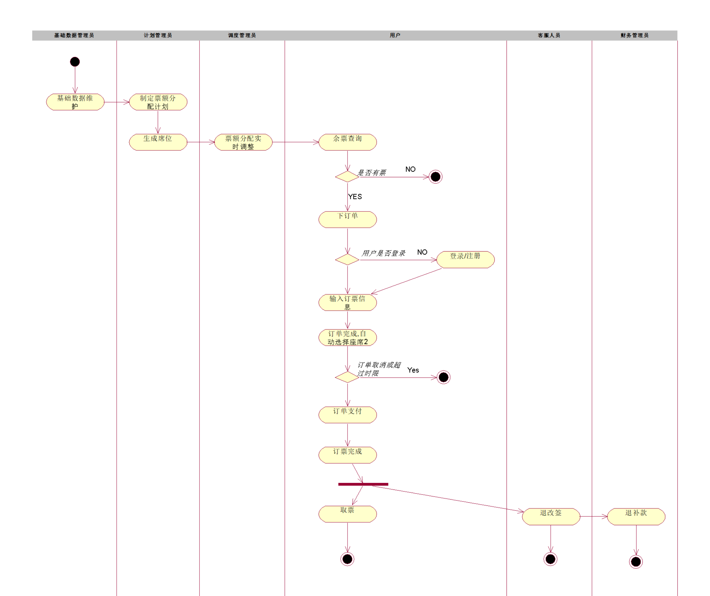
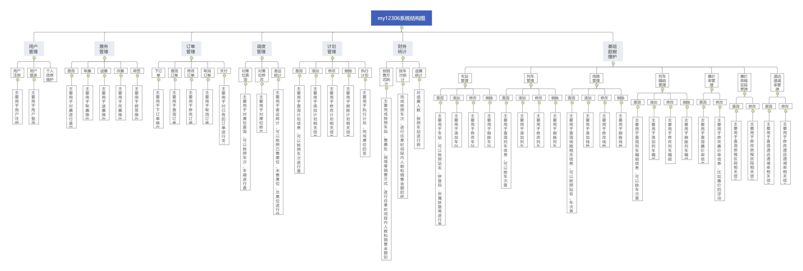
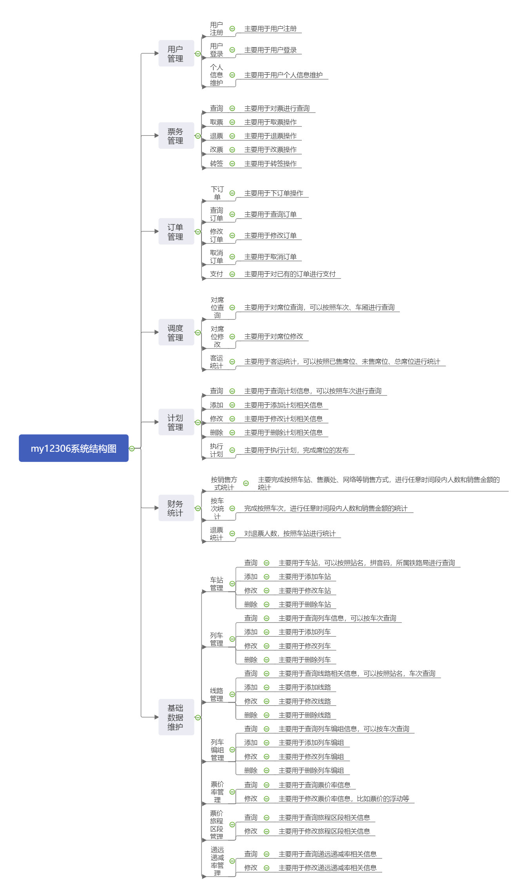
#### 总体架构
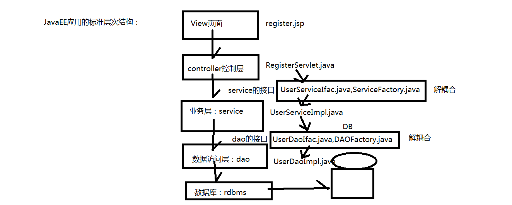

#### 技术选型

#### 数据库设计
##### my12306_tab_user
|列名|数据类型|可否为空|说明|
| -- | -- | -- | -- |
| id | number(11)    | not null  | id(Parimary主键)  |  
| username   | varchar2(30)   | not null | 用户名(Unique唯一)   | 
| password   | varchar2(50)   | not null | 密码   |  
| rule   | varchar2(2)  | not null | 权限(1 管理员 2 普通用户) |
| realname   | varchar2(50)   | not null | 真实姓名   |  
| sex   | char(1)    | not null | 性别(1 男 2 女)   |  
| city   | number(11)    | not null | 城市信息id值((Foreign外键my12306_tab_city))   |  
| cert_type   | number(11)    | not null | 证件类型(1二代身份证2港澳通行证3台湾通行证4护照)(Foreign外键my12306_tab_certtype)   |  
| cert   | varchar2(50)    | not null | 证件号码   |  
| birthday   | date   | not null | 生日   |  
| user_type   | number(11)   | not null | 旅客类型(1成人2儿童3学生4残疾军人、伤残人民警察)((Foreign外键my12306_tab_usertype))   |  
| content   | varchar2(3000)    | null   | 备注信息   |  
| status   | char(1)   | not null | 用户状态(0 无效 1 有效)   | 
| login_ip   | varchar2(50)   | not null   | 登陆IP   |  
| image_path   | varchar2(200)    |  not null | 用户头像路径   |   

##### my12306_tab_usertype
|列名|数据类型|可否为空|说明|
| -- | -- | -- | -- |
| id | number(11)    | not null  | id (主键)  |  
| content   | varchar2(40)   | not null | 旅客类型(1成人2儿童3学生4残疾军人、伤残人民警察)    | 
##### my12306_tab_province
|列名|数据类型|可否为空|说明|
| -- | -- | -- | -- |
| id | number(11) | not null  | id (主键)  |  
| provinceid   | varchar2(6)   | not null | 省份标识   |
| province | varchar2(40) | not null  | 省份名称  |  
##### my12306_tab_city
|列名|数据类型|可否为空|说明|
| -- | -- | -- | -- |
| id | number(11) | not null  | id (主键)  |  
| cityid   | varchar2(6)   | not null | 城市标识   |
| city | varchar2(50) | not null  | 城市名称  |  
| father | varchar2(6) | not null  | 省份标识  |  
#### my12306_tab_certtype
|列名|数据类型|可否为空|说明|
| -- | -- | -- | -- |
| id | number(11)    | not null  | id (主键)  |  
| content   | varchar2(20)   | not null | 证件类型(1二代身份证2港澳通行证3台湾通行证4护照)| 


项目所用技术：Servlet、单例模式


项目中所遇bug：

1. HTTP Status 404 - /my12306/top.jsp

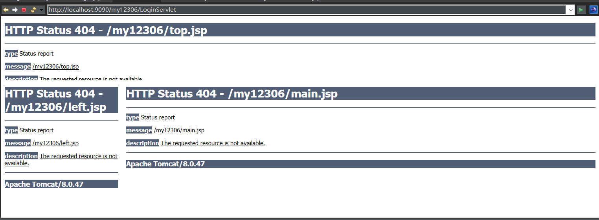

**错误原因：**
index.jsp的framest下的frame的top.jsp路径不对
```
<%@ page language="java" contentType="text/html; charset=UTF-8"
    pageEncoding="UTF-8"%>
<!DOCTYPE HTML>
<html>
<head>
<meta http-equiv="Content-Type" content="text/html; charset=utf-8">
<title>无标题文档</title>
</head>
<frameset rows="130,*" cols="*" frameborder="no" border="0" framespacing="0">
  <frame src="top.jsp" name="topFrame" scrolling="No" noresize="noresize" id="topFrame" title="topFrame">
  <frameset rows="*" cols="247,*" framespacing="0" frameborder="no" border="0">
    <frame src="left.jsp" name="leftFrame" scrolling="No" noresize="noresize" id="leftFrame" title="leftFrame">
    <frame src="main.jsp" name="mainFrame" id="mainFrame" title="mainFrame">
  </frameset>
</frameset>
<noframes>
<body>
</body>
</noframes></html>
```
**解决方法：** 将路径重新配置正确
```
<frame src="<%=request.getContextPath() %>/user/top.jsp" name="topFrame" scrolling="No"
 noresize="noresize" id="topFrame" title="topFrame">
  <frameset rows="*" cols="247,*" framespacing="0" frameborder="no" border="0">
    <frame src="<%=request.getContextPath() %>/user/left.jsp" name="leftFrame" 
    scrolling="No" noresize="noresize" id="leftFrame" title="leftFrame">
    <frame src="<%=request.getContextPath() %>/user/main.jsp" name="mainFrame"
     id="mainFrame" title="mainFrame">
```
 2. HTTP Status 500 - Unable to compile class for JSP: 
 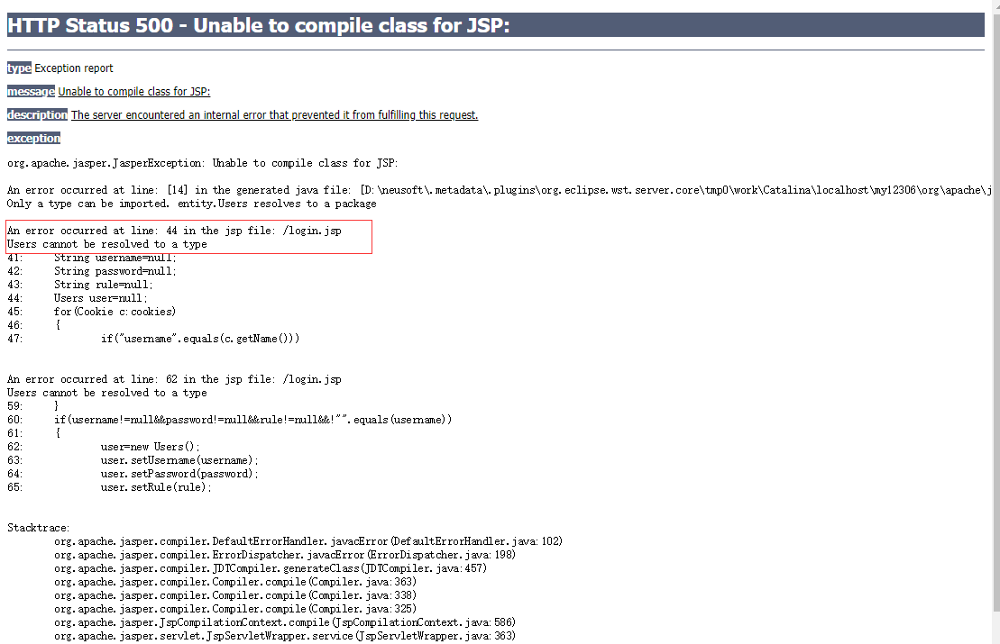

 **原因：包名路径导入错误**
 ```
 <%@ page language="java" contentType="text/html; charset=UTF-8"
    pageEncoding="UTF-8" import="entity.Users" %>
 ```
**解决方法：** 将路径重新配置正确
```
<%@ page language="java" contentType="text/html; charset=UTF-8"
    pageEncoding="UTF-8" import="net.ptcs.my12306.entity.Users" %>
```
3. HTTP Status 500 - java.lang.NullPointerException
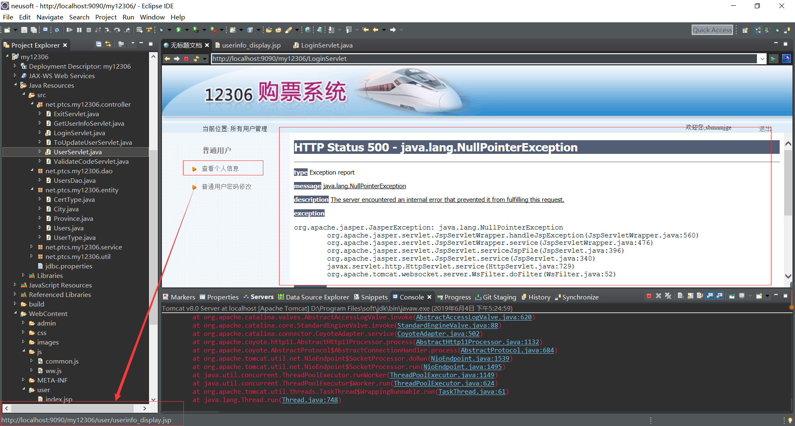
**原因：此点击跳转的路径未正确设置，必须先经过Servlet而后跳转**
```
  <tr>
    <td align="right">/
    images/ny_arrow1.gif" width="24" height="13"></td>
    <td height="35"><a href="<%=request.getContextPath()%>/user/
    userinfo_display.jsp" target="mainFrame"class="cray">查看个人信
    息</a></td>
  </tr>
```
**解决方法：** 将路径重新配置正确
```
  <tr>
    <td align="right">/images/ny_arrow1.gif" width="24" height="13"></td>
    <td height="35"><a href="<%=request.getContextPath()%>/GetUserInfoServlet" target="mainFrame"class="cray">查看个人信息</a></td>
  </tr>
```
4. HTTP Status 500 - The absolute uri: http://java.sun.com/jsp/jstl/core cannot be resolved in eithe...

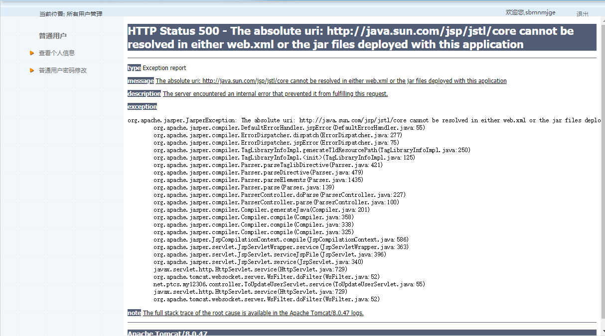

**原因：** 在浏览器访问web项目的时候发现的，错误提示标签库没有在web.xml定义，同时其他jar包中也没有出现。

**解决方法：** 在tomcat下将jstl-1.2jar放入到lib文件夹下，重新启动tomcat即可！

5. eclipse提交git远程仓库成功而git远程仓库未显示有提交用gitBash提交显示如下错错误

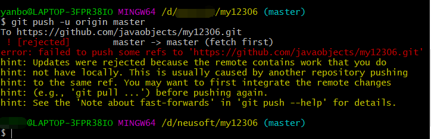

**原因：** 可能是因为某个文件不在本地代码目录中

**解决方法:**
```
1. git pull --rebase origin master//代码合并
2. git push origin master//提交代码
```
6. HTTP Status 500 - Servlet execution threw an exception

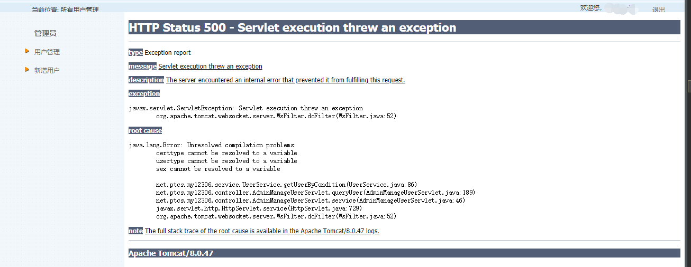

**原因：** 命名未统一
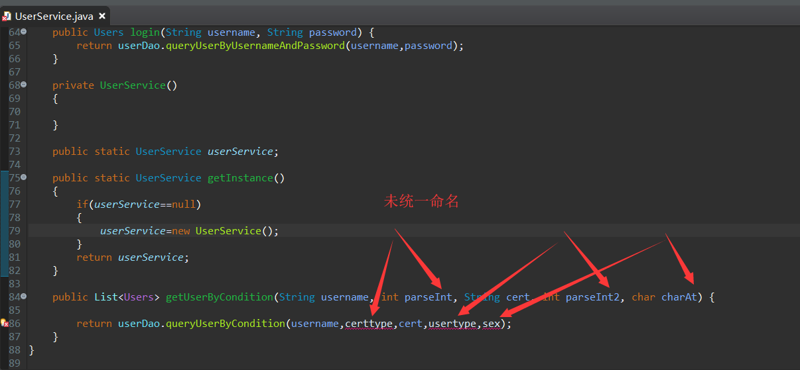
**解决方法：将其命名弄统一**
```
	public List<Users> getUserByCondition(String username, int certtype, String cert, int usertype, char sex) {

		return userDao.queryUserByCondition(username,certtype,cert,usertype,sex);
	}
```
7. HTTP Status 500 - Unable to process parts as no multi-part configuration has been provided

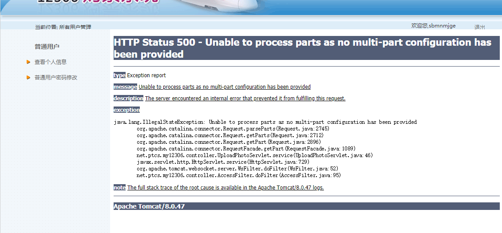

**原因：** 未在Servlet中加 @MultipartConfig

**解决方法：将其加上**

如图：
